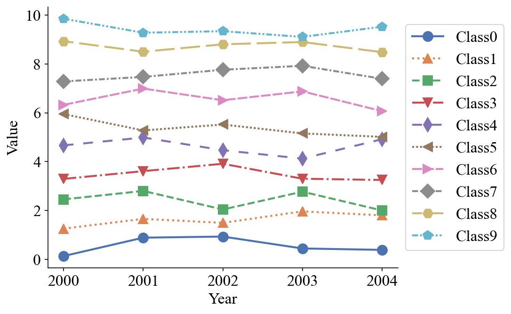
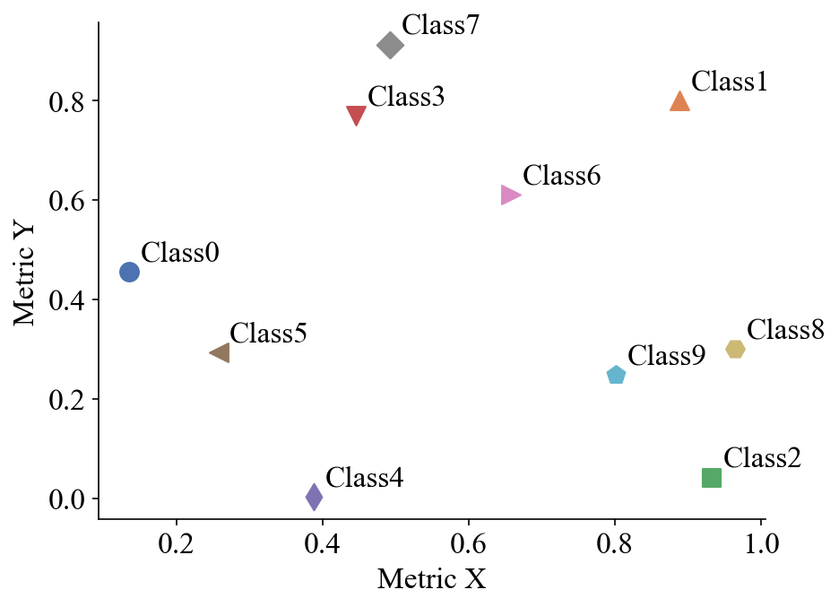
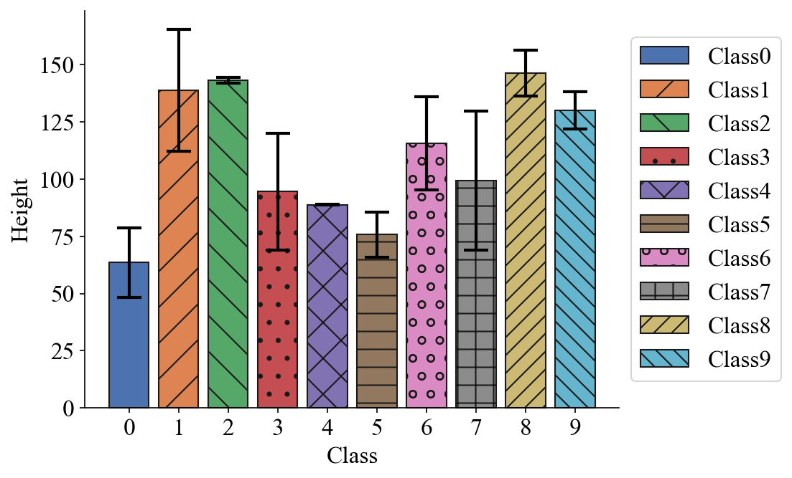
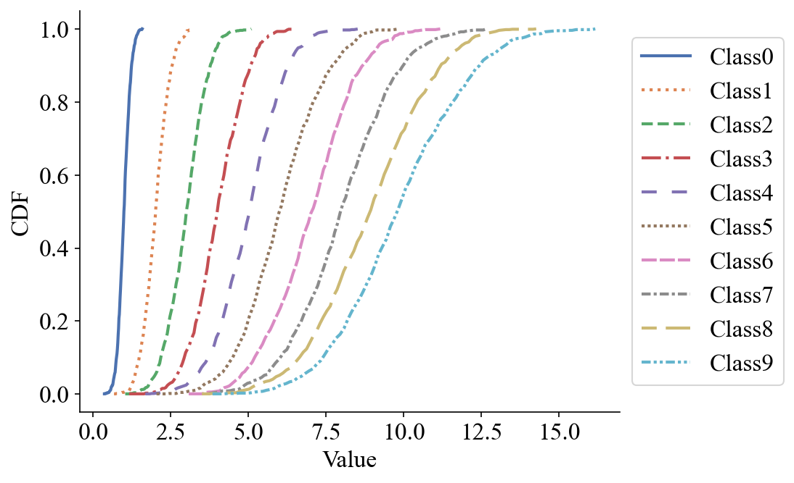
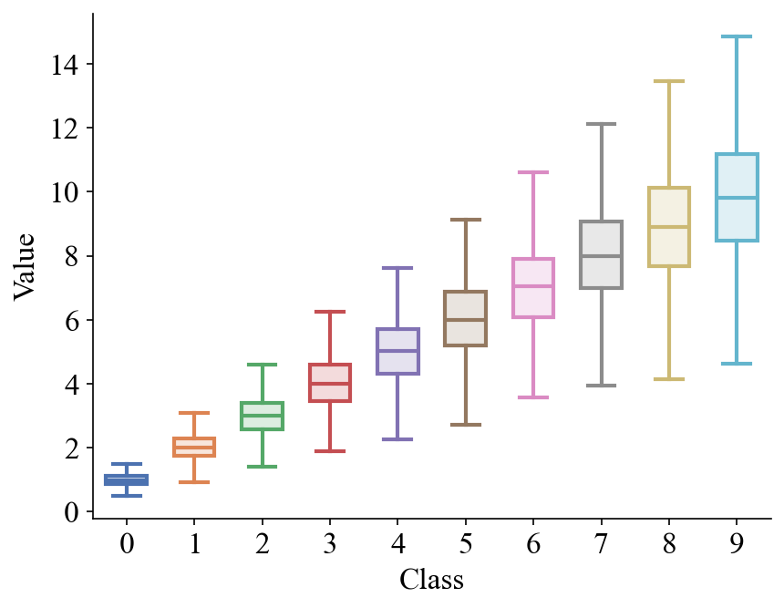
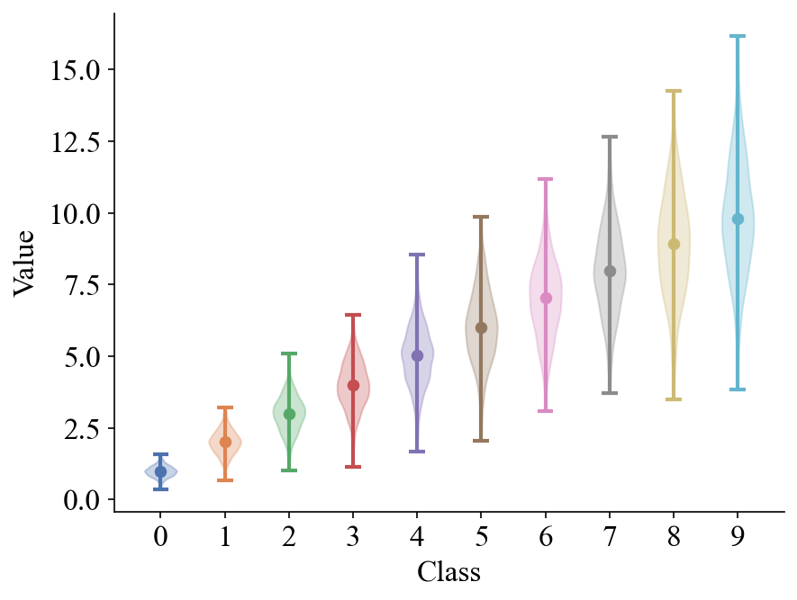

# Pretty Plots @ Bonsai Group

This repository contains scripts for plotting "publication-quality" figures
with the `matplotlib` library in Python.
[Example outputs](#examples) are shown below.

## Usage

1. Install the required Python packages:

    ```shell
    pip install -r requirements.txt
    ```

2. Confirm that the "Times New Roman" font is installed on your system:

    ```shell
    $ python3
    >>> import matplotlib.font_manager as fm
    >>> fm.findfont('Times New Roman')
    ```

    * If the font is not found on Ubuntu, run:
        ```shell
        # install Times New Roman through Microsoft Core Fonts
        sudo apt install ttf-mscorefonts-installer

        # clear matplotlib's cache
        rm -r ~/.cache/matplotlib
        ```
        Next, restart the Python interpreter and find the font again.
        Example output of a successful installation is
        `/usr/share/fonts/truetype/msttcorefonts/Times_New_Roman.ttf`.

    * Alternatively, install LaTeX and set `'text.usetex': True` in `utils.py`.
      LaTeX fonts such as "Times New Roman" and "Computer Modern" should now be
      available, but text rendering will be slower.

3.  Edit figure parameters in `utils.py` as needed,
    and run the desired plotting script (e.g., `./line_plot.py`).


## Examples

### Line plot



### Scatter plot



### Bar plot



### CDF plot



### Box plot



### Violin plot


